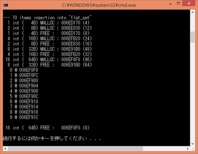
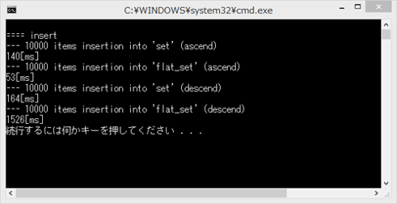
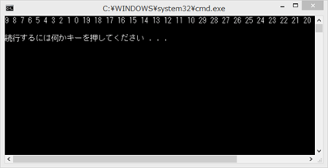

## flat_(multi)map/set
- Map 같지만 Map 같지 않은…
- 속은 vector 이다.
- 순회, 참조가 빠르다.
- 작은 메모리 사용
- 추가,삭제는 느리다(단 N > 100 일 때).
- 반복자 안정성이 없다.
- 요소 수가 작은 경우 강추.
  
 
### flat_(multi)set 
- std::set 보다 작은 메모리 사용.
- 요소 삽입에는 시간이 좀 걸리지만 lookup(검색)에서는 바이너리 서치를 사용할 수 있어서 빠르다.
  
#### 예제 코드 1
```C++
// http://codezine.jp/article/detail/8259

void memory_usage() {
  cout << "\n==== memory usage\n";
  const int N = 10;

  {
  cout << "\n--- " << N << " items insertion into 'set'\n";

  std::set<int,std::less<int>,epi::mallocator<int>> fs;
  for ( int i = 0; i < N; ++i ) {
    fs.insert(N-i-1);
  }

  for ( const int& item : fs ) {
    cout << setw(4) << item << " @ " << static_cast<const void*>(&item) << endl;
  }
  cout << endl;
  }
  cout << endl;

  {
  cout << "\n--- " << N << " items insertion into 'flat_set'\n";

  boost::container::flat_set<int,std::less<int>,epi::mallocator<int>> fs;
  for ( int i = 0; i < N; ++i ) {
    fs.insert(N-i-1);
  }

  for ( const int& item : fs ) {
    cout << setw(4) << item << " @ " << static_cast<const void*>(&item) << endl;
  }
  cout << endl;
  }
  cout << endl;

}
```
  
   
flat_set은 메모리의 할당과 해방을 반복하면서 점차 영역을 넓히고 있다. 또 각 요소의 주소도 선두부터 말미까지 연속으로 나란하다.  
  
std::set에서는 오름차순/내림차순에서 소요 시간에 큰 차이는 없지만, flat_set은 내림차순에서 삽입이 꽤 약다.  
요소를 리니어 하면서 오름차순으로 저장하지 않으면 삽입 때마다 복사가 빈발하게 발생한다.  
 
  
    
#### 예제 코드 2
요소의 중복을 허용한 flat_multiset에 동일 값 요소를 다수 삽입한다.  
int 값의 첫째 자리를 무시하고 29,28,27,...2,1,0을 삽입한다.  
첫째 자리를 무시하므로 29~20,19~10,9~0은 각각 같은 값 요소가 된다   
```C++
// http://codezine.jp/article/detail/8259

#include <iostream>
#include <iomanip>
#include <boost/container/flat_set.hpp>

using namespace std;
using namespace boost::container;

template<typename T>
struct less1 {
  bool operator()(T x, T y) const { return x/10 < y / 10; }
};

int main() {
  const int N = 30;

  {
  flat_multiset<int,less1<int>> fs;
  for ( int i = 0; i < N; ++i ) {
    fs.insert(N-i-1);
  }
  for ( int item : fs ) {
    cout << item << ' ';
  }
  cout << endl;
  }
  cout << endl;

}
```  
  
동일 값 요소를 다수 삽입하면 삽입한 순서로 나란히 해준다.   
약간은 코드를 읽어 본 결과 삽입 위치를 upper_bound로 결정하고 있었다.  
   
 
  
  
### flat_map_
  
#### 예제 프로그램
- flat_map_01  


