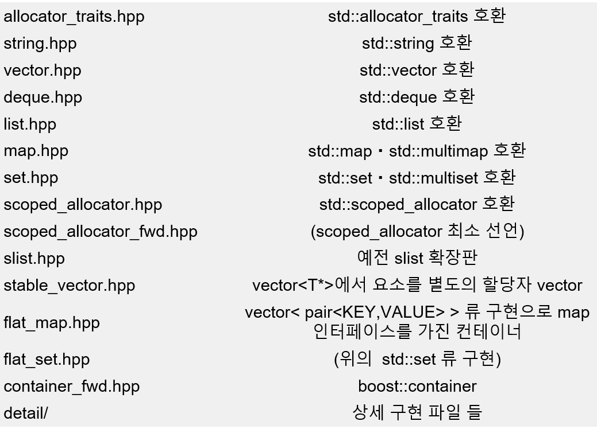

# Boost 라이브러리 - 컨테이너
    
- [multi_index](multi_index.md)
- [circular_buffer](circular_buffer.md)  
- [Heap](heap.md)
- Boost.Container  
  1.48 버전에서 새로 추가. STL 호환 컨테이너 라이브러리   
  C++03 컴파일러에서  C++11의 기능을 사용할 수 있음Move semantics, placement insertion, recursive containers.  
  Containers support stateful allocators and are compatible with Boost.Interprocess (they can be safely placed in shared memory).  
  The library offers new useful containers:    
      
  Boost.Pool은 너무 오래되어 유지보수 되지 않고 있어서 이제는 Boost.Container 에 C++17 표준에 들어갈 예정인 Polymorphic Memory Resources(http://faithandbrave.hateblo.jp/entry/2016/08/08/170454)가 있으므로 이것을 사용하는 쪽이 더 좋은 듯.  
  계산량과 성능은 명기 되어 있지 않아서 실측할 필요는 있지만 문제를 보고해서 개선되는 것은 이쪽이라고 생각된다.   
  Polymorphic Memory Resources는 Boost 라이브러리 1.60.0 에서 구현이 되었다.  
    - [static_vector](static_vector.md)
    - [stable_vector](stable_vector.md)  
    - [flat_(multi)map/set](flat_map-set.md)
     
- tool
    - [CPPDebuggerVisualizers](https://github.com/KindDragon/CPPDebuggerVisualizers) 
- 참고
    - [Intrusive data structure 소개](http://www.slideshare.net/ohyecloudy/intrusive-data-structure) 