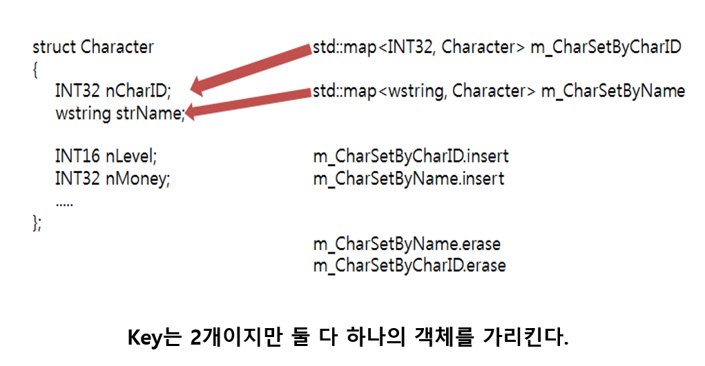
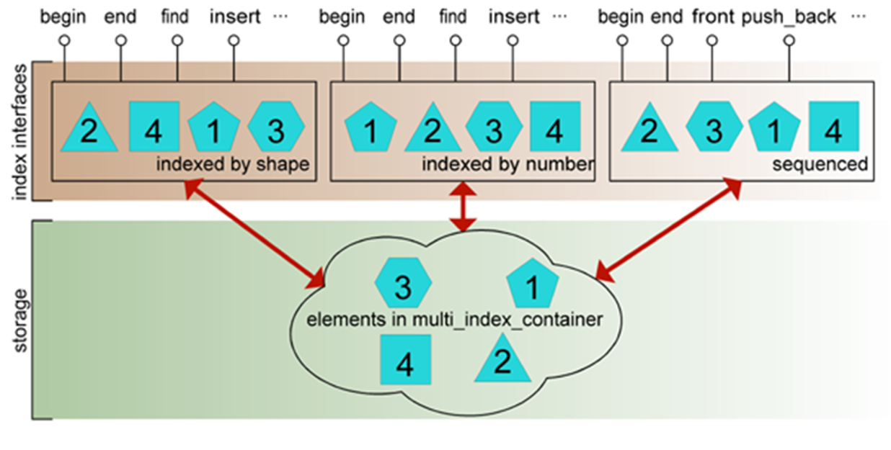
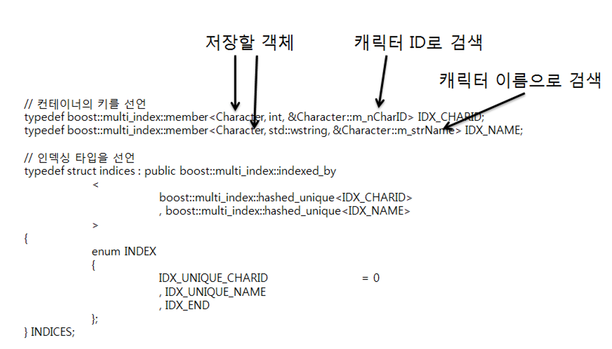
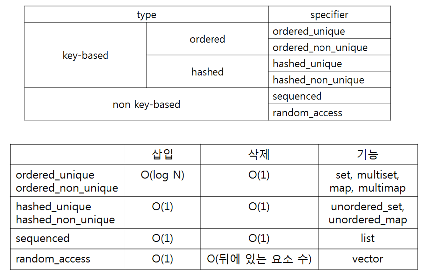
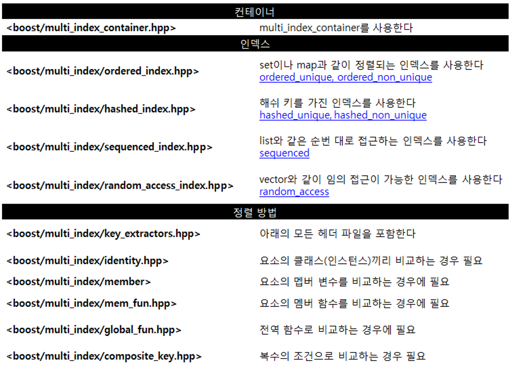

## multi_index
#### multi : 다양한    
#### index : 색인  
  
  
  
    
    
  
    
  
    

    
  
### Key 종류
- lidentity
- lmember
- lconst_mem_fun
- lmem_fun
- lglobal_fun
- lcomposite_key
  
  
### 예제 코드
- multi_index_01. std::list + std::multiset
- multi_index_02. std::vector + std::multiset
- multi_index_03. 가독성 Up
- multi_index_04. 유저 정의 타입 사용
- multi_index_05. 유저 정의 타입 + 멤버 함수 키 + 합성 키 + bound
- multi_index_06. 유저 정의 타입 + std::multiset + std::map
- multi_index_07. replace
- multi_index_08. modify
- multi_index_09. member_offset_
  
   
### 참고
- [boost::multi_index 간단 사용법](http://egloos.zum.com/humnya/v/2905407) 
- [Boost.multi_index 사용하기](https://www.slideshare.net/OnGameServer/sdc-3rd) 
- [Boost - Multi Index Map](http://sysroad.dlinkddns.com/phame/post/view/30/boost_-_multi_index_map/) 
- [boost::multi_index](http://neive.tistory.com/212) 
  
  