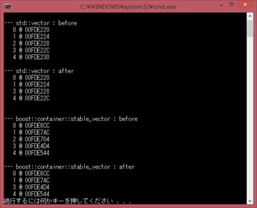
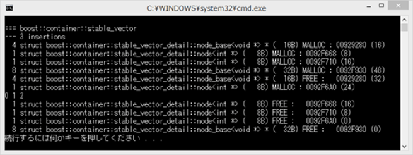
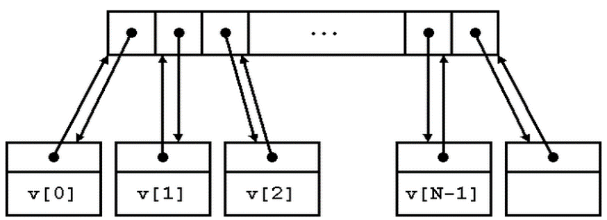

## stable_vector
- 이름 그대로 안정된 vector.
- std::vector는 저장된 요소의 연속성을 보장하지만 반복자가 무효화 될 수 있다.(이 문제를 해결하려면 std::list 사용)
- stable_vector는 요소의 연속성 확보 보다 요소를 가리키는 포인터를 연속으로 보존.
- 리스트와 비슷하지만 임의접근이 가능하다.
- 삽입, 삭제가 발생하여도 저장된 요소가 이동하지 않는다.
- 요소 중에 새로운 요소를 추가하여도 그 이후의 모든 요소를 이동하지 않고 포인터를 복사하는 것으로 완료.
    
  
### 예제 코드
```C++
std::vector<int> v;

v.push_back(1);
auto const it = v.begin();

for (int i = 2; i < 10; ++i)
  v.push_back(i);

// ???
std::cout << *it;
```
  
```C++
// http://codezine.jp/article/detail/8259 

void memory_usage() {
  cout << "\n=== memory_usage\n";
  {
  std::vector<int> v;
  for ( int i = 0; i < 5; ++i ) {
    v.emplace_back(i);
  }
  cout << "\n--- std::vector : before\n";
  for ( const int& val : v ) {
    cout << setw(4) << val << " @ " << static_cast<const void*>(&val) << endl;
  }

  cout << "\n--- std::vector : after\n";
  v.erase(begin(v)+2);
  for ( const int& val : v ) {
    cout << setw(4) << val << " @ " << static_cast<const void*>(&val) << endl;
  }

  cout << endl;
  }  

```  
      
메모리가 연속적으로 할당 되지 않는다.
  
```C++
//http://codezine.jp/article/detail/8259

void memory_detail() {
  cout << "\n=== boost::container::stable_vector\n--- 3 insertions\n";
  boost::container::stable_vector<int,epi::mallocator<int>> vv;
  for ( int i = 0; i < 3; ++i ) {
    vv.emplace_back(i);
  }
  for ( int item : vv) {
    cout << item << ' ';
  }
  cout << endl;
}
```
      
<br><br>  
포인터 배열의 각 요소에 node가 매달려서, 각 노드는 반대 방향 포인터를 가지고 있다.   
그래서 stable_vecto의 반복자는 각 node를 가리킨다. 그래서 어떤 반복자에 대해서,   
  node에서 node*열에 오르고  
  거기서 n개 이동한다(포인터에 n을 더한다)  
  node에 내린다  
라는 조작으로 n개 옆으로 이동할 수 있다.  
이런 편법으로 랜덤 접근을 구현하고 있어서 예를 들면 std::sort()로 정렬할 수 있다.  
또 이 구조에 의해 어떤 요소를 가리키는 반복자는(그 요소를 삭제하지 않는 한) 요소의 삽입/삭제에 따른 무효가 되는 일이 없다.    
          
  

### 예제 프로그램   
- stable_vector_01
- stable_vector_02
  
  
### 장단점
- 요소의 안정성을 중시해서 각종 성능에서는 vector, list에 비해 다소 떨어진다.
- 요소 접근을 위해 1회 불필요한 간접 참조를 해야하므로 vector 보다 느리다.
- 요소들을 연속해서 보존하고 있다는 것을 보증할 수 없으므로 캐시 효율도 나쁘다.
- vector 보다 많은 메모리를 필요로 한다.   
  (c + 1)p + (n + 1)(e + p) 
  c=capacity(), p=sizeof(T*), n=size(), e=sizeof(T)  
  vector는 c×e  
- 그러나 때로는 vector 보다 더 적은 메모리를 사용하기도 한다.  
  c >> n 일 때는 요소를 저장하기 위한 영역이 vector은 cXe 이지만 stable_vector는 nXe만 필요로 한다.  
- 이름과 다르게 vector의 대체보다는 list의 대체에 더 가깝다.
  
  
